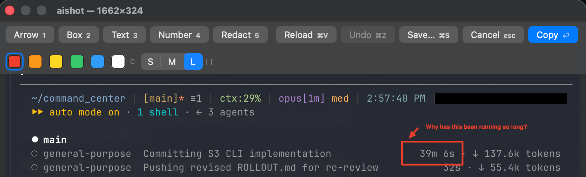

<div align="center">


# aishot

**Mark up the screenshot on your clipboard and paste it into an AI coding session.**

[](https://github.com/dlomibao/aishot/actions/workflows/ci.yml)
[](https://github.com/dlomibao/aishot/releases/latest)

</div>



macOS already takes the screenshot. This is the missing second half — arrows,
boxes, text, numbered steps and redaction on top of whatever image is on the
clipboard, then the annotated PNG replaces it.

Pointing at the thing you mean is much faster than describing it. "The button
in the lower right, no, the other one" becomes an arrow.

## Use

1. **`⌃⇧⌘4`** — drag a region. macOS copies it to the clipboard.
2. **Your hotkey** — the editor opens on that image.
3. Mark it up.
4. **`⏎`** — the annotated image is on your clipboard. Paste it.

| Key | |
|---|---|
| `1` … `6` | arrow, box, text, number badge, redact, crop |
| `C` | cycle colour |
| `[` `]` | smaller / larger stroke and text |
| `⌘Z` | undo — walks back through crops as well as annotations; while typing, undoes the typing |
| `⌘V` | load the screenshot now on the clipboard |
| `⌘S` | save a PNG to `~/Downloads`, keep editing |
| `⇧⏎` `⌥⏎` `⌃⏎` | line break while typing text |
| `⏎` | copy annotated image and close |
| `esc` | cancel, leaving the clipboard untouched — asks first if you have drawn anything; while typing, discards just that text box |

Arrows, boxes, redactions, text boxes and crops are drag; badges are click.

**Text wraps inside the box you drag.** Drag out a width with the Text tool and
the text wraps within it, growing downward as you type — long notes no longer
run off the edge. `⏎` commits; for a deliberate line break use `⇧⏎`, `⌥⏎` or
`⌃⏎` — the last two are macOS's own bindings, the first is the one chat apps
taught everyone. Clicking instead of dragging gives you a sensible default
width. An unbroken token like a URL is broken rather than allowed to overflow.

**Crop waits for confirmation.** Drag a region and everything outside it dims,
with ✓ and ✕ buttons by the selection. `⏎` or `C` confirms, `esc` discards the
selection without touching the image. Cropping keeps your existing markup and
is undoable — `⌘Z` restores the previous framing, so a mis-crop costs nothing.

**Keep the window open across shots.** `⌃⇧⌘4` again, then `⌘V` swaps in the new
screenshot without relaunching. It asks first if you have already drawn
something.

**Style applies to what you draw next.** Each shape keeps the colour and size
it was drawn with, so a yellow note can sit beside a red arrow. Markup is sized
in screen points, so it looks the same on a thin toolbar strip as on a
full-window grab. Your last choice is remembered between launches.


**Redaction is destructive.** It writes solid black into the output pixels
rather than laying an overlay on top, so the original content is genuinely gone
from what you paste — worth knowing before you screenshot something with a
token in it.

Every image you copy is also archived to `~/Pictures/aishots/`, as a fallback
for targets that take a file but not a pasteboard image.

## Install

### Download a release

1. Grab the latest `AIShot-*.zip` from
   [**Releases**](https://github.com/dlomibao/aishot/releases/latest) and unzip it.
2. Drag `AIShot.app` into `~/Applications` (or `/Applications`).
3. **Remove the download quarantine.** Skip this and macOS will refuse to open
   the app:

   ```sh
   xattr -dr com.apple.quarantine ~/Applications/AIShot.app
   ```

4. [Bind a hotkey](#bind-a-hotkey).

> **Why step 3?** The app is not signed with an Apple Developer ID, which costs
> $99/year. macOS quarantines anything downloaded from the internet and, for
> unsigned apps, reports it as damaged or unverifiable rather than saying what
> is actually wrong. The command above clears the quarantine flag. If you would
> rather not run it, build from source — that path never gets quarantined.
>
> You can also go to **System Settings → Privacy & Security** and click
> **Open Anyway** after the first blocked launch.

Releases are **Apple Silicon only** and require macOS 13 or later.

### Build from source

```sh
git clone https://github.com/dlomibao/aishot.git
cd aishot
./scripts/install.sh
```

Builds, bundles `AIShot.app` into `~/Applications`, and drops a Raycast script
command into `~/.raycast-scripts`. Needs the Swift toolchain from Xcode or the
Command Line Tools. No dependencies, nothing at runtime.

### Bind a hotkey

The app deliberately has no hotkey of its own — it is launched by whatever you
already use.

**Raycast** — Settings → **Extensions** → **+** → **Add Script Directory** →
choose `~/.raycast-scripts`, then set a hotkey on *Annotate Clipboard
Screenshot*. `./scripts/install.sh` puts the script there for you; if you
installed from a release, copy
[`raycast/annotate-clipboard.sh`](raycast/annotate-clipboard.sh) into that
folder yourself.

**Shortcuts.app** — new Shortcut → *Run Shell Script* →
`open -a ~/Applications/AIShot.app` → assign a keyboard shortcut.

**skhd** — add to `~/.skhdrc`:

```
cmd + shift + ctrl - 5 : open -a ~/Applications/AIShot.app
```

Anything that can run `open -a ~/Applications/AIShot.app` works.

## Why it does not take the screenshot itself

Screen capture needs a TCC grant, and a binary run from a terminal inherits the
*terminal's* grant — so behaviour differs between development and the installed
app, on exactly the kind of managed machine where you least want to debug it.

Handing capture to the OS removes that surface completely. `⌃⇧⌘4` is already
muscle memory, already permitted, and already handles multiple displays, Stage
Manager and Retina scaling correctly. The app starts from the clipboard.

## Develop

```sh
swift build           # the app
./scripts/test.sh     # core tests (needs Xcode's toolchain for XCTest)
./scripts/install.sh  # build, bundle, install, wire up Raycast
```

CI builds, tests and bundles on every push. Tagging `v*` builds a release and
publishes the zip automatically:

```sh
git tag v0.2.0 && git push origin v0.2.0
```

`AIShotCore` holds the annotation model, the coordinate transform and the
renderer, with no window code — that is where the tests live. `aishot` is the
AppKit shell around it.

The decision the rest of the code hangs off: **annotations are stored in image
pixel coordinates, and one `Renderer.draw` renders both the on-screen canvas
and the exported PNG.** The preview cannot drift from the output, because it is
the output at a different scale. Retina screenshots survive the round trip at
full resolution.

The example image above is generated by `scripts/make-readme-assets.swift`
using that same renderer, so the README cannot advertise markup the app does
not actually draw.

See [`docs/design.md`](docs/design.md) for the rest.
